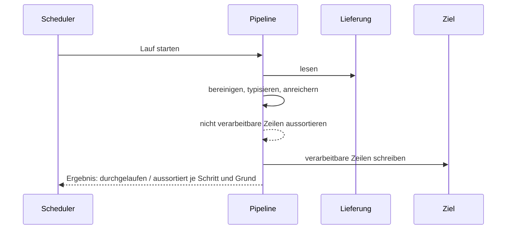

# Use Cases

Die Abläufe, für die gseq-table v2 gebaut wird, und die Fragen, die sie an das Design
stellen. Antworten stehen nicht hier, sondern in den Design Decisions. Wo eine Frage
beantwortet ist, verweist sie darauf.

## Akteure

| Akteur | Rolle |
|---|---|
| Pipeline-Entwickler | schreibt und pflegt ETL-Pipelines mit der Library; derzeit hauptsächlich der Maintainer, perspektivisch mehrere |
| Datenlieferant | Kunde oder externer Anbieter, der Rohdaten liefert (häufig Excel, außerdem CSV und JSON); ändert Format oder Inhalt gelegentlich ohne Ankündigung |
| Scheduler | startet Läufe ohne menschliches Zutun, meistens ein Cron |
| Ziel | nimmt das Ergebnis eines Laufs entgegen: Datenbank, Datei oder ein HTTP-Endpunkt, an den JSON gepostet wird |
| Externer Entwickler | nutzt die Library ohne Kontext des Maintainers, eingebunden per `go get` |

### UC1 — Geplanter Lauf über eine Lieferung

**Akteur(e):** Scheduler, Datenlieferant, Ziel
**Auslöser:** Der Scheduler startet den Lauf zu seiner festen Zeit; eine Lieferung des
Datenlieferanten liegt vor (typischerweise eine Excel-Datei).
**Ablauf:** Die Pipeline liest die Lieferung, bereinigt und typisiert die Werte, reichert
sie an und schreibt das Ergebnis ins Ziel. Zeilen, die ein Schritt nicht verarbeiten kann,
werden aussortiert, statt den Lauf abzubrechen. Der Lauf kommt durch, und die verarbeitbaren
Daten kommen im Ziel an, auch wenn ein Teil der Lieferung fehlerhaft ist. Am Ende ist
festgehalten, wie viele Zeilen durchgelaufen sind und wie viele in welchem Schritt aus
welchem Grund aussortiert wurden. Die aussortierten Zeilen schickt die Pipeline über einen
Writer in einem gewünschten Format an ein Ziel.

**Erzwingt Entscheidungen:**
- Was ist ein Datenfehler, der eine Zeile aussortiert, und was ist ein Konfigurationsfehler, der den Lauf verhindert oder abbricht? → [D19](10-design-decisions.md#d19-es-gibt-drei-fehlerarten-planfehler-lieferfehler-und-datenfehler), Wahl zwischen aussortieren und stoppen: [D3](10-design-decisions.md#d3-das-fehlerverhalten-ist-pro-pipeline-wahlbar-aussortieren-oder-sofort-stoppen), Panik in einer Closure: [D39](10-design-decisions.md#d39-eine-panik-in-einer-closure-wird-wie-ein-zuruckgegebener-fehler-behandelt)
- Wann ist ein Lauf erfolgreich: immer, wenn er durchkommt, oder gibt es eine Schwelle (z. B. Anteil aussortierter Zeilen), ab der er als fehlgeschlagen gilt? → [D4](10-design-decisions.md#d4-eine-pipeline-kann-eine-schwelle-fur-aussortierte-zeilen-festlegen), Bemessung und Wirkung: [D20](10-design-decisions.md#d20-die-schwelle-ist-absolut-oder-als-anteil-je-lauf-oder-je-schritt-und-lasst-den-lauf-per-voreinstellung-zu-ende-laufen)
- Wie erfährt der Scheduler vom Ergebnis (Exit-Code, Rückgabewert, Bericht)? → Zählungen: [D43](10-design-decisions.md#d43-gezahlt-werden-quellzeilen-in-vier-kategorien-und-der-rohzustand-wird-bei-jedem-verlassen-des-plans-freigegeben), Schwelle: [D45](10-design-decisions.md#d45-die-schwelle-bezieht-anteile-auf-bisher-gelesene-zeilen-gilt-bei-einer-der-grenzen-und-bricht-erst-nach-einer-mindestzahl-ab); [D21](10-design-decisions.md#d21-ein-lauf-liefert-einen-status-und-zahlungen-aus-denen-sich-ein-exit-code-ableiten-lasst), Bericht: [D23](10-design-decisions.md#d23-das-laufergebnis-enthalt-einen-anderungsbericht)
- Wohin gehen die aussortierten Zeilen eines Laufs, und in welchem Format? → [D49](10-design-decisions.md#d49-aussortierte-zeilen-umfangreicher-laufe-werden-uber-writer-im-plan-wahrend-des-laufs-geschrieben-sonst-halt-sie-das-ergebnis-bis-close), [D1](10-design-decisions.md#d1-aussortierte-zeilen-sind-eine-tabelle-aus-rohzustand-und-info-spalten), [D2](10-design-decisions.md#d2-aussortierte-zeilen-werden-uber-dieselben-writer-geschrieben-wie-ergebnisse), je Quelle: [D13](10-design-decisions.md#d13-aussortierte-zeilen-gibt-es-je-quelle-dazu-eine-ubersicht-uber-alle-quellen)
- Gehören Writer für Datenbank und HTTP-JSON zur Library, oder nur Datei-Writer? → [D35](10-design-decisions.md#d35-ziele-werden-uber-eine-sink-schnittstelle-beschrieben-mit-datei-writern-und-kleinen-paketen-fur-datenbank-und-http)
- Was passiert, wenn das Ziel das Schreiben ablehnt? → gestoppte Läufe: [D51](10-design-decisions.md#d51-im-modus-stoppen-wird-der-scheiternde-block-nicht-geschrieben-bereits-geschriebene-blocke-bleiben), [D40](10-design-decisions.md#d40-ein-fehler-beim-schreiben-in-ein-ziel-bricht-den-lauf-sofort-mit-dem-status-sink_error-ab)

### UC2 — Datenlieferant ändert das Lieferformat unangekündigt

**Akteur(e):** Datenlieferant, Pipeline-Entwickler
**Auslöser:** Die Lieferung weicht vom bisherigen Aufbau ab, zum Beispiel eine umbenannte
oder neue Spalte, ein anderes Datumsformat oder ein neuer Wertebereich.
**Ablauf:** Der nächste Lauf verarbeitet die Lieferung wie gewohnt. Die Zeilen, die vom
geänderten Aufbau betroffen sind, werden aussortiert; die übrigen kommen im Ziel an. Der
Pipeline-Entwickler bemerkt die Änderung am Ergebnis des Laufs, sieht, was genau sich
geändert hat, und hat die betroffenen Zeilen vorliegen, um die Pipeline anzupassen.

**Erzwingt Entscheidungen:**
- Woran bemerkt der Pipeline-Entwickler eine Änderung: am Anstieg der aussortierten Zeilen, an einem Abgleich gegen einen erwarteten Aufbau, oder an beidem? → beides: [D22](10-design-decisions.md#d22-eine-quelle-kann-einen-erwarteten-aufbau-haben-gegen-den-die-lieferung-beim-lesen-gepruft-wird), [D23](10-design-decisions.md#d23-das-laufergebnis-enthalt-einen-anderungsbericht), später [D24](10-design-decisions.md#d24-ein-lauf-kann-ein-profil-liefern-das-mit-dem-profil-eines-fruheren-laufs-verglichen-wird); Anstieg als Signal über die Schwelle: [D4](10-design-decisions.md#d4-eine-pipeline-kann-eine-schwelle-fur-aussortierte-zeilen-festlegen), [D20](10-design-decisions.md#d20-die-schwelle-ist-absolut-oder-als-anteil-je-lauf-oder-je-schritt-und-lasst-den-lauf-per-voreinstellung-zu-ende-laufen)
- Fehlt eine erwartete Spalte ganz: Werden alle Zeilen aussortiert, oder ist das ein Konfigurationsfehler, der den Lauf stoppt? → Status in jedem Fall `delivery_error`: [D42](10-design-decisions.md#d42-jeder-lieferfehler-setzt-den-status-delivery_error); Lieferfehler, konfigurierbar: [D19](10-design-decisions.md#d19-es-gibt-drei-fehlerarten-planfehler-lieferfehler-und-datenfehler), [D3](10-design-decisions.md#d3-das-fehlerverhalten-ist-pro-pipeline-wahlbar-aussortieren-oder-sofort-stoppen)
- Wie wird eine neue, unerwartete Spalte behandelt (ignorieren, melden, durchreichen)? → [D22](10-design-decisions.md#d22-eine-quelle-kann-einen-erwarteten-aufbau-haben-gegen-den-die-lieferung-beim-lesen-gepruft-wird)
- Wie wird "was genau hat sich geändert" dargestellt (Spalte, betroffene Werte, Beispiele)? → [D23](10-design-decisions.md#d23-das-laufergebnis-enthalt-einen-anderungsbericht)
- Lässt sich unterscheiden, ob ein Wert leer ist, fehlt oder nicht parsebar war? → [D30](10-design-decisions.md#d30-es-gibt-echte-nullwerte-getrennt-vom-leeren-text)

### UC3 — Pipeline-Entwickler untersucht aussortierte Zeilen

**Akteur(e):** Pipeline-Entwickler
**Auslöser:** Ein Lauf hat Zeilen aussortiert (nach [UC1](#uc1-geplanter-lauf-uber-eine-lieferung) oder [UC2](#uc2-datenlieferant-andert-das-lieferformat-unangekundigt)).
**Ablauf:** Der Pipeline-Entwickler holt sich die aussortierten Zeilen des Laufs. Jede
liegt im Originalzustand vor, so wie sie in der Lieferung stand, zusammen mit dem Schritt,
der sie aussortiert hat, dem Grund, der betroffenen Spalte und dem Rohwert. Er findet die
Zeile in der Originaldatei wieder und kann den Fehler nachstellen.

**Erzwingt Entscheidungen:**
- Was genau ist der Originalzustand: die Zellwerte, wie der Reader sie gelesen hat, oder auch die Rohbytes (z. B. eine CSV-Zeile mit kaputten Anführungszeichen)? → [D1](10-design-decisions.md#d1-aussortierte-zeilen-sind-eine-tabelle-aus-rohzustand-und-info-spalten), [D10](10-design-decisions.md#d10-rohzustand-bedeutet-gelesene-zellwerte-rohbytes-bei-unzerlegbaren-zeilen-und-immer-die-fundstelle)
- Wie wird eine Zeile in der Quelle wiedergefunden (Datei, Sheet, Zeilennummer, Byte-Offset), und bleibt das über Sortieren, Filtern und Joins hinweg erhalten? → Fundstelle: [D10](10-design-decisions.md#d10-rohzustand-bedeutet-gelesene-zellwerte-rohbytes-bei-unzerlegbaren-zeilen-und-immer-die-fundstelle); nach Join [D47](10-design-decisions.md#d47-ergebniszeilen-tragen-einen-row_key-aus-ihren-quellzeilen-und-bei-1n-joins-scheitern-nur-die-betroffenen-ergebniszeilen), [D11](10-design-decisions.md#d11-scheitert-eine-zeile-nach-einem-join-wird-jede-beteiligte-quellzeile-aussortiert), nach Aggregation [D12](10-design-decisions.md#d12-der-rohzustand-reicht-bis-zum-ersten-schritt-uber-alle-zeilen-danach-wird-die-aggregierte-zeile-aussortiert)
- Was wird bei großen Lieferungen für jede Zeile mitgeführt, damit der Originalzustand der aussortierten Zeilen verfügbar ist, ohne den Speicherbedarf aller Zeilen zu vervielfachen? → [D10](10-design-decisions.md#d10-rohzustand-bedeutet-gelesene-zellwerte-rohbytes-bei-unzerlegbaren-zeilen-und-immer-die-fundstelle), [D9](10-design-decisions.md#d9-der-rohzustand-wird-getrennt-gehalten-an-verzweigungen-wird-immer-kopiert)
- Wird eine Zeile, die in mehreren Schritten scheitern würde, beim ersten Fehler aussortiert, oder werden alle Gründe gesammelt? → eine Zeile je Quellzeile: [D44](10-design-decisions.md#d44-die-tabelle-je-quelle-hat-eine-zeile-je-quellzeile-die-ubersicht-einen-eintrag-je-fehler); [D15](10-design-decisions.md#d15-eine-zeile-wird-im-ersten-scheiternden-schritt-aussortiert-mit-einem-eintrag-je-betroffener-spalte); Info-Spalten: [D14](10-design-decisions.md#d14-info-spalten-tragen-ein-reserviertes-einstellbares-prafix); je Quelle: [D13](10-design-decisions.md#d13-aussortierte-zeilen-gibt-es-je-quelle-dazu-eine-ubersicht-uber-alle-quellen); Gründe aus Hauptweg und Zweig: [D27](10-design-decisions.md#d27-eine-im-zweig-erneut-gescheiterte-zeile-behalt-ihre-kennung-und-zeigt-ihren-weg)

### UC4 — Aussortierte Zeilen werden nach einer Anpassung nachverarbeitet

**Akteur(e):** Pipeline-Entwickler, Ziel
**Auslöser:** Der Pipeline-Entwickler hat die Pipeline an eine Änderung angepasst
(nach [UC2](#uc2-datenlieferant-andert-das-lieferformat-unangekundigt)) und will die
Daten, die im Lauf gefehlt haben, nachliefern.
**Ablauf:** Er startet die angepasste Pipeline auf den aussortierten Zeilen eines früheren
Laufs statt auf einer neuen Lieferung. Die jetzt verarbeitbaren Zeilen kommen im Ziel an;
was weiterhin scheitert, wird wieder aussortiert.

**Erzwingt Entscheidungen:**
- Können aussortierte Zeilen direkt als Quelle einer Pipeline dienen, mit ihrem Originalzustand statt ihrem Zustand zum Zeitpunkt des Fehlers? → aggregierte Zeilen: [D48](10-design-decisions.md#d48-nach-einer-gruppierung-aussortierte-zeilen-stehen-in-einer-eigenen-tabelle); [D16](10-design-decisions.md#d16-aussortierte-zeilen-konnen-quelle-eines-laufs-sein-und-behalten-ihre-ursprungliche-fundstelle), Originalzustand: [D10](10-design-decisions.md#d10-rohzustand-bedeutet-gelesene-zellwerte-rohbytes-bei-unzerlegbaren-zeilen-und-immer-die-fundstelle), Tabellen je Quelle: [D13](10-design-decisions.md#d13-aussortierte-zeilen-gibt-es-je-quelle-dazu-eine-ubersicht-uber-alle-quellen)
- Wie und wie lange werden aussortierte Zeilen zwischen Läufen aufbewahrt? → [D17](10-design-decisions.md#d17-die-library-bewahrt-aussortierte-zeilen-nicht-selbst-auf)
- Wie werden doppelte Einträge im Ziel vermieden, wenn Zeilen nachgeliefert werden? → [D47](10-design-decisions.md#d47-ergebniszeilen-tragen-einen-row_key-aus-ihren-quellzeilen-und-bei-1n-joins-scheitern-nur-die-betroffenen-ergebniszeilen), [D18](10-design-decisions.md#d18-jede-quellzeile-tragt-einen-stabilen-schlussel-optional-einen-inhalts-hash), Upsert im Datenbank-Writer: [D35](10-design-decisions.md#d35-ziele-werden-uber-eine-sink-schnittstelle-beschrieben-mit-datei-writern-und-kleinen-paketen-fur-datenbank-und-http)

### UC5 — Nicht verarbeitbare Zeilen laufen im selben Lauf durch einen eigenen Zweig

**Akteur(e):** Pipeline-Entwickler
**Auslöser:** Der Pipeline-Entwickler weiß, dass ein Teil der Zeilen einen Schritt nicht
besteht, und will sie anders behandeln, statt sie nur auszusortieren.
**Ablauf:** In der Pipeline zweigt er die Zeilen ab, die einen Schritt nicht bestehen,
verarbeitet sie mit anderen Regeln weiter und führt sie danach wieder mit den übrigen
zusammen. Was auch im Zweig scheitert, wird aussortiert.

**Erzwingt Entscheidungen:**
- Wie werden die gescheiterten Zeilen eines Schritts innerhalb des Laufs abgezweigt, und in welchem Zustand (Original oder Stand vor dem Schritt)? → [D25](10-design-decisions.md#d25-gescheiterte-zeilen-eines-schritts-konnen-in-einen-zweig-gegeben-werden-und-laufen-danach-zuruck), Info-Spalten: [D14](10-design-decisions.md#d14-info-spalten-tragen-ein-reserviertes-einstellbares-prafix), Rohzustand im Hintergrund: [D9](10-design-decisions.md#d9-der-rohzustand-wird-getrennt-gehalten-an-verzweigungen-wird-immer-kopiert)
- Wie werden Zweige wieder zusammengeführt, wenn sie unterschiedliche Spalten oder Typen haben? → [D26](10-design-decisions.md#d26-zweige-werden-nach-spaltennamen-zusammengefuhrt-typkonflikte-sind-planfehler), Nullwerte für fehlende Spalten: [D30](10-design-decisions.md#d30-es-gibt-echte-nullwerte-getrennt-vom-leeren-text)
- Wie bleibt bei einer Zeile, die im Zweig scheitert, nachvollziehbar, dass sie zuvor schon im Hauptweg gescheitert war? → [D46](10-design-decisions.md#d46-gerettete-zeilen-behalten-ihre-geschichte-und-die-schwelle-zahlt-nur-endgultig-aussortierte), [D27](10-design-decisions.md#d27-eine-im-zweig-erneut-gescheiterte-zeile-behalt-ihre-kennung-und-zeigt-ihren-weg)

### UC6 — Eine umfangreiche Lieferung wird verarbeitet, ohne vollständig im RAM zu liegen

**Akteur(e):** Pipeline-Entwickler, Scheduler
**Auslöser:** Eine Lieferung ist groß (bis in den zweistelligen GB-Bereich).
**Ablauf:** Dieselbe Pipeline, die für kleine Lieferungen geschrieben wurde, verarbeitet
die große Lieferung, ohne sie vollständig in den Speicher zu laden. Die Verarbeitung
beginnt, während noch gelesen wird. Der Pipeline-Entwickler muss dafür höchstens an einer
Stelle etwas ändern, nicht jeden Schritt umschreiben. Der Lauf ist langsamer als ein
spezialisiertes Werkzeug, aber er kommt mit begrenztem Speicher durch. Eine veränderbare
(mutable) Datenstruktur braucht der Maintainer dafür nicht, wenn es ohne sie gleich gut geht.

**Erzwingt Entscheidungen:**
- Wie wird zwischen "alles im Speicher" und "während des Lesens verarbeiten" umgeschaltet, und muss der Entwickler das überhaupt wählen? → [D6](10-design-decisions.md#d6-pipelines-sind-plane-die-in-blocken-ausgefuhrt-werden-und-auf-die-platte-auslagern-konnen)
- Was passiert mit Schritten, die alle Zeilen brauchen (Sortieren, Gruppieren, Joins, Pivot), wenn nicht alles in den Speicher passt: auslagern auf die Platte, verbieten, oder nur für kleine Seiten erlauben? → auslagern: [D6](10-design-decisions.md#d6-pipelines-sind-plane-die-in-blocken-ausgefuhrt-werden-und-auf-die-platte-auslagern-konnen)
- Wie wird der Speicherbedarf begrenzt oder konfiguriert? → [D28](10-design-decisions.md#d28-ein-lauf-hat-ein-speicherbudget-und-ein-verzeichnis-zum-auslagern)
- Was bleibt von ausgelagerten Daten zurück, wenn ein Lauf abbricht oder vom System beendet wird? → [D28](10-design-decisions.md#d28-ein-lauf-hat-ein-speicherbudget-und-ein-verzeichnis-zum-auslagern), [D38](10-design-decisions.md#d38-ein-spaterer-lauf-entfernt-verwaiste-ausgelagerte-daten)
- Braucht es eine veränderbare (mutable) Datenstruktur, um schnell und speichersparend genug zu sein, oder erreicht eine unveränderliche mit geteilten Spalten dieselben Ergebnisse? → Engine entscheidet: [D7](10-design-decisions.md#d7-die-engine-entscheidet-ob-sie-daten-kopiert-oder-an-ort-und-stelle-andert); Voreinstellung unveränderlich: [D5](10-design-decisions.md#d5-voreinstellung-durchlauf-mit-aussortieren-unveranderliche-tabellen); Bedarf offen: [G5](70-gap-ledger.md#g5-ob-es-eine-veranderbare-tabelle-braucht)
- Kann der Entwickler das Kopieren oder Ändern selbst festlegen? → [D8](10-design-decisions.md#d8-eine-option-legt-fest-dass-die-engine-immer-kopiert-oder-immer-an-ort-und-stelle-andert); an Verzweigungen wird trotzdem kopiert: [D9](10-design-decisions.md#d9-der-rohzustand-wird-getrennt-gehalten-an-verzweigungen-wird-immer-kopiert)
- Bringt spaltenorientierte Speicherung hier messbare Vorteile? → [D29](10-design-decisions.md#d29-daten-laufen-in-blocken-typisierter-spalten-rohspalten-bleiben-bis-zum-cast-text), Messung offen: [G13](70-gap-ledger.md#g13-vorteil-spaltenorientierter-blocke-und-voreinstellungen-fur-budget-und-blocklange)

### UC7 — Externer Entwickler baut seine erste Pipeline

**Akteur(e):** Externer Entwickler
**Auslöser:** Jemand ohne Kontext des Maintainers will schmutzige Lieferungen, z. B. Excel
von Anbietern, stabil verarbeiten und bindet die Library ein.
**Ablauf:** Er liest eine Datei ein, beschreibt die Schritte, lässt den Lauf laufen und
bekommt Ergebnis und aussortierte Zeilen, ohne vorher das Fehlermodell im Detail verstehen
zu müssen. Die Voreinstellungen führen zu einem stabilen Lauf, nicht zu einem Abbruch beim
ersten schmutzigen Wert.

**Erzwingt Entscheidungen:**
- Welche Voreinstellungen gelten, wenn der Entwickler nichts zum Fehlerverhalten angibt? → [D5](10-design-decisions.md#d5-voreinstellung-durchlauf-mit-aussortieren-unveranderliche-tabellen), je Fehlerart: [D19](10-design-decisions.md#d19-es-gibt-drei-fehlerarten-planfehler-lieferfehler-und-datenfehler)
- Welche Typen tauchen in der öffentlichen API auf (eigene Typen der Library, Standardtypen, Typen aus gseq)? → [D33](10-design-decisions.md#d33-die-offentliche-api-verwendet-standard-go-typen-und-eigene-typen-der-library-keine-gseq-typen)
- Wie viele Wege gibt es, dieselbe Operation auszudrücken (Methode, Pipeline-Schritt, Ausdruck), und welcher ist der naheliegende? → Fehler bei sofortigen Tabellen: [D50](10-design-decisions.md#d50-eine-tabelle-tragt-ihre-aussortierten-zeilen-und-einen-haftenden-fehler), [D31](10-design-decisions.md#d31-jede-operation-gibt-es-einmal-als-wert-mit-zwei-einstiegen-sofort-auf-einer-tabelle-oder-im-plan), [D32](10-design-decisions.md#d32-ausdrucke-sind-der-standard-fur-berechnungen-closures-der-ausweg)
- Welche Stabilitätszusage gibt v2 gegenüber externen Nutzern? → [D34](10-design-decisions.md#d34-der-prototyp-liegt-unter-experimentalv2-ohne-zusage-v200-ist-ein-eigenes-modul-mit-semver), Umstieg: [D36](10-design-decisions.md#d36-ein-adapter-wandelt-zwischen-v1-und-v2-tabellen)
